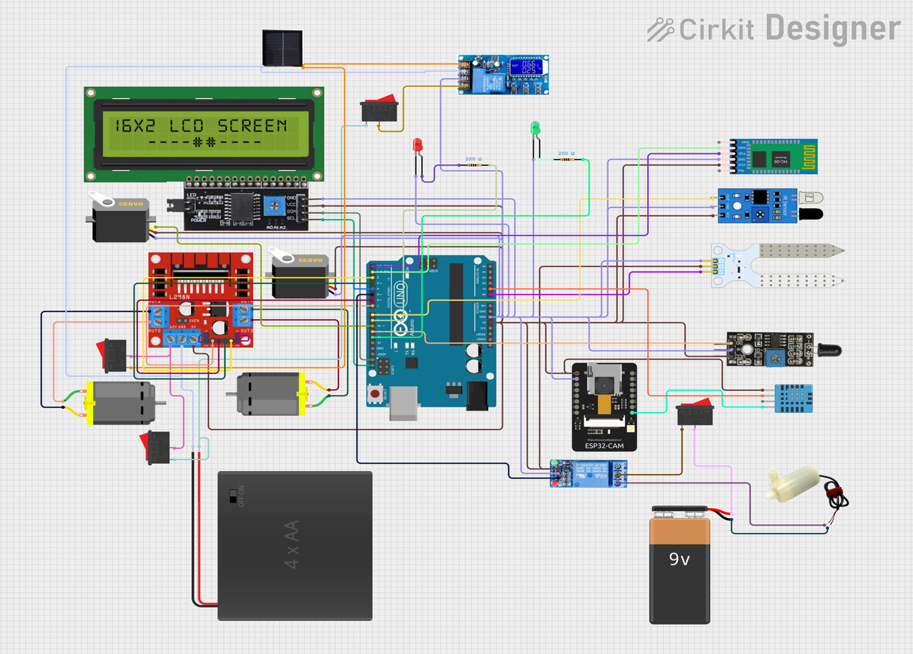

🌱 CropX Rover – A Sustainable IoT Rover for Modern Agriculture
CropX Rover is a solar-powered IoT-based smart farming assistant that integrates irrigation, fire safety, and real-time monitoring into a single compact system. Designed for precision agriculture, CropX aims to reduce manual labour, optimize resource usage, and improve crop yield while being sustainable, affordable, and scalable.

🚜 Problem Statement

•	Farmers face labour shortages and increasing operational costs.

•	Irrigation inefficiency leads to ~60% water wastage.

•	Unpredictable climate reduces crop reliability.

•	Farm fires destroy thousands of hectares annually.

•	No existing compact solution addresses all these issues together.

🌍 Relevance

•	Agriculture = backbone of food security.

•	70% of freshwater is used in farming, much of it wasted.

•	Over-irrigation → soil damage + reduced profit.

•	Automation + IoT → key to sustainable and smart farming.

💡 Proposed Solution

•	CropX Rover acts as a farmer’s assistant by:

•	💧 Automatic irrigation when soil moisture is low.

•	🌡️ Real-time monitoring of soil, temperature, and humidity.

•	🔥 Fire detection & suppression using flame sensor + water pump.

•	📷 ESP32 camera for live video monitoring.

•	📡 Remote control via WiFi + Bluetooth.

✨ Distinctive Features

•	All-in-one rover: Irrigation + Fire Safety + Monitoring.

•	Solar powered for sustainability.

•	Obstacle detection for field navigation.

•	Dual communication → reliable in both rural & urban setups.

•	Adaptable to any crop type, farm size, or geography.

⚙️ Technical Approach

•	Arduino UNO as central controller.

•	Soil Moisture & DHT11 sensors → irrigation precision.

•	Flame sensor + water pump → instant fire response.

•	ESP32 camera → live farm video.

•	WiFi + Bluetooth → dual control.

•	Solar powered for clean, renewable energy.

📊 Impact

•	💧 Saves up to 60% water vs. traditional irrigation.

•	🌾 Boosts crop yield while lowering costs.

•	🔥 Prevents farm losses from fire hazards.

•	📡 Enables remote farm supervision, reducing labour needs.

•	✅ Supports UN SDG 2 (Zero Hunger) & SDG 12 (Responsible Consumption & Production).

⚡ Challenges & Solutions

•	⚡ Power supply → solved with solar energy.

•	📶 Connectivity issues → dual WiFi + Bluetooth.

•	💰 Costs → minimized using low-cost sensors + open-source tech.

•	🛠️ Durability → compact & rugged design.

🔮 Future Scope

•	🤖 AI integration → predict crop yield & detect diseases.

•	🚁 Drone support → aerial farm monitoring.

•	☁️ Cloud dashboard → manage multiple farms.

•	💰 Cost: Current prototype ≈ ₹3,900. For large-scale advanced deployment, cost may rise according to market needs

